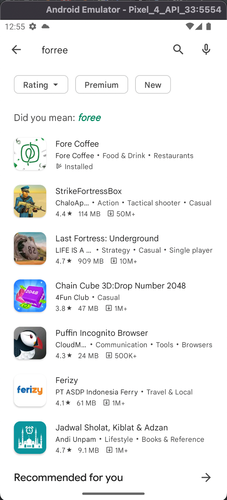

## Software Requirement
Software harus diinstall terlebih dahulu seperti menginstall
- Install Android Studio
- Install ADB
- Install Appium Server

# Pre Running Script
Sebelum running script kita harus menjalankan
- Appium server 
  - Create Devices from Android Studio
    - Click Dot dan pilih Virtual Devices Manager 
    - Create Devices di window Virtual Devices Manager 
    - Pilih Device yang ada google play-nya 
    - Install Aplikasi Foree di simulator 
    - Jalankan Script
    ```bash
    avd devices -l untuk melihat device yang tersedia
    ```
    
   
    - Ganti UUID script dengan device yang diinginkan dari perintah avd tadi, pada contoh kali ini menggunakan device 
    ```
    emulator-5554
    ```
    - 
    

## Running Script
Untuk dapat running script bisa di buka melalui editor intellj atau editor yang lain seperti eclipse, dan melakukan running pada class
```bash
ForeTestingApps
```

## Hasil Record Aplikasi
Berikut merupakan record dari hasil testing aplikasi foree yang diminta
